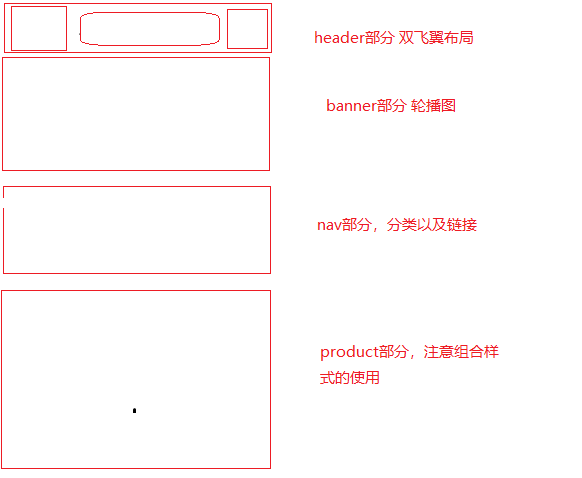

## moblie...1

## 流式布局

> 流式布局就是百分比布局，非固定像素，内容向两侧填充，理解成流动的布局

## viewport

> 视觉窗口，移动端特有的。这是一个虚拟的区域，承载网页的。 浏览器->viewport->网页
>
> 适配要求
>
> > + 网页宽度必须和浏览器保持一致
> > + 默认显示的缩放比例和PC端保持（缩放比例1.0）
> > + 不允许用户自行缩放网页
>
> 适配设置
>
> > + width    可以设置宽度
> > + height   可以设置高度
> > + initial-scale  可以设置默认的缩放比例
> > + user-scalable  可以设置是否允许用户自行缩放
> > + maximum-scale  可以设置最大缩放比例
> > + minimum-scale  可以设置最小缩放比例 
>
> 标准适配设置
>
> > meta name='viewport',content="width=divice-width,initial-scale=1.0,user-scalable=no"
>
> 非主流适配(了解吧)
>
> > 非主流的适配方案：
> >  1.页面的真实尺寸会比在设备上的尺寸要大几倍
> >  2.假设设备是iphone4 -> 320px -> 网页尺寸 640px
> >  3.缩放操作，有2倍的  有3倍  和屏幕像素比有关系
> >  4.什么是屏幕像素（物理像素，像素点） px(页面的尺寸单位)
> >  5.物理像素 是设备显示屏的最小可视颗粒的大小   以前的手机（直板手机）
> >  6.现在有 高清显示屏  视网膜屏  retina屏
> >  7.显示的效果就提高了更细腻，但是在显示同等质量的图片的时候（模糊效果）                                                 8.在屏幕像素比（一个px宽的屏幕能放几个物理像素）高的设备  图片（非矢量）显示会模糊
> > 9.提高网页的清晰度  根据屏幕的像素比 来缩放网页
> > 10.但是这样的适配方案成本非常高
> > 11.一般的企业开发当中使用的还是标准化设置
> >
> > 在高清显示屏当中：图片可能会失真（模糊）
>
> 不建议使用jquery
>
> > 移动端没有IE浏览器
> >
> > 内核基本上都是  webkit  或者 blink  兼容  -webkit-
> >
> > 使用H5的api 或者说使用一个 叫做： zepto.js 的库（基于高版本浏览器开发）

## 网页构建注意点

> box-sizing: border-box;
>
> > 防止内容溢出，百分比布局无法计算尺寸
>
> -webkit-tap-highlight-color: transparent;
>
> > a链接在移动端会高亮显示，需要清除时设定
> >
> > -webkit-tap-highlight-color: transparent;
>
> img下边空隙解决
>
> > 是由基线引起的，与文字尺寸有关系
> >
> > 解决（三种方式）
> >
> > > + font-size设为0px
> > > + img 设置vetical-align:middle
> > > + img 设置display:block
>
> resize:none
>
> > 防止textarea能够拉伸
>
> outline:none
>
> > 点击文本框时不高亮显示

## 第一个经历的布局如下

> 
>
> ### 精灵图公用样式（还不会）
>
> > [class^="icon_"],[class*=" icon_"]{
> >     background-repeat: no-repeat;
> >     background-image: url("../images/sprites.png");
> >     background-size: 200px 200px;
> > }

